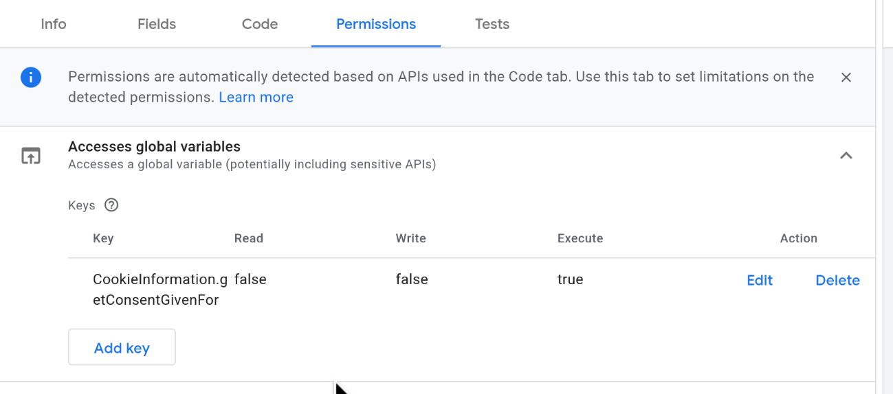
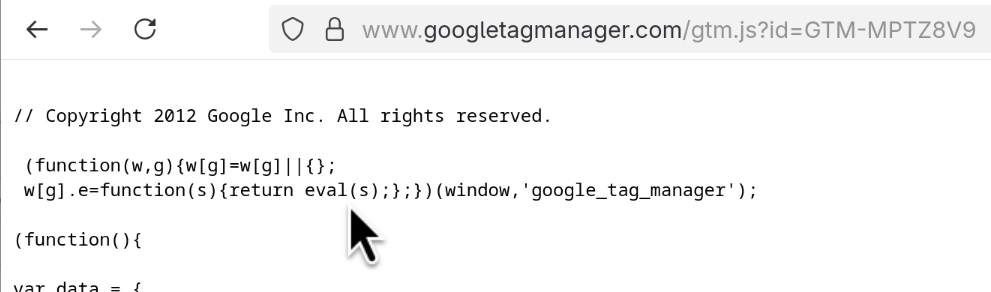

# CSP: dropping `'unsafe-inline'` — a practical path to `'strict-dynamic'`

Presentation version: [CSP in 2026 slides](./bornhack-2026-csp-talk.html).

CSP is widely deployed but rarely effective. A June 2026 crawl of the Tranco Top 1 Million sites found 170,057 with a CSP — yet **46.8% still contain `'unsafe-inline'`**, 41.9% allow `'unsafe-eval'`, and only 24.7% carry a nonce. Just **1.6% use `'strict-dynamic'`**, the one directive that makes a script policy actually hold up.[^csp-2026]

`'strict-dynamic'` lets you drop `'unsafe-inline'`, domain allowlists, and most of the ongoing maintenance burden. It was proposed as the fix back in a 2016 Google Research study — the same study that found 94.68% of script-restricting policies were ineffective and 99.34% of CSP hosts gained no XSS benefit at all.[^csp-stats] It has been supported across Chrome, Firefox, and Safari since March 2022. A decade on, adoption of the fix that study proposed still sits at 1.6%.

The reason adoption stays low is that the ecosystem makes the secure path hard. Third-party tools, legacy scripts, and CMS platforms still default to `'unsafe-inline'`, and removing it tends to break things — consent banners, tag managers, admin UIs — with fixes that are rarely obvious.

This post is about what it actually takes to get there anyway, and why it is worth it. Adoption will only rise once services, tools, and frameworks make the secure path the easy one. The other driver is compliance pressure — which is what prompted the most recent CSP implementations we did.

## What `unsafe-*` costs you — and what you gain by removing it

`'unsafe-inline'` in `script-src` allows any inline script on the page to execute. That includes the ones an attacker injected. It does not matter how the injection happened — a reflected parameter, a stored payload, a compromised dependency. If `'unsafe-inline'` is present, CSP will not stop it.

`'unsafe-eval'` is similarly corrosive: it permits `eval()`, `new Function()`, and similar constructs, which are the classic vehicle for turning injected strings into executing code.

The common alternative — enumerating trusted script domains in `script-src` — is better than `'unsafe-inline'` but still leaves you exposed to any script hosted on those domains[^csp-allowlist-weakness], including ones an attacker could place there.

**The payoff for eliminating `'unsafe-*'` from `script-src` is `'strict-dynamic'`[^strict-dynamic].** Once inline scripts and eval are off the table, you can use a nonce-based policy with `'strict-dynamic'`, which is considerably simpler to operate than the alternatives:

- No domain allowlist to maintain. You do not need to enumerate every CDN, analytics endpoint, or third-party library host.
- Minimal nonce propagation. You attach a nonce to your entry-point scripts; `'strict-dynamic'` automatically extends trust to any scripts they load dynamically, without you having to touch them.

**What is a nonce?** A nonce is a per-request cryptographically random value (typically base64-encoded) that the server generates on every response and injects into two places:

1. As a `nonce` attribute on each inline `<script>` tag you want to allow
2. In the `script-src` directive of the CSP header (e.g. `'nonce-ABC123...'`)

The browser matches them: if the nonce on the script tag matches one in the CSP, the script is allowed. If not, it is blocked.

Here is how to generate and inject a nonce in various frameworks:

**AdonisJS[^adonis-shield-ssr]:**
```typescript
// config/shield.ts
import { defineConfig } from '@adonisjs/shield'

const shieldConfig = defineConfig({
  csp: {
    enabled: true,
    directives: {
      defaultSrc: [`'self'`],
      scriptSrc: [`'self'`, '@nonce', `'strict-dynamic'`],
      styleSrc: [`'self'`, '@nonce'],
    },
    reportOnly: false,
  },
})

export default shieldConfig
```

Shield automatically generates a unique nonce for each request. In Edge templates, use the `cspNonce` variable:

```html
<script nonce="{{ cspNonce }}">
  // This inline script executes because it has a valid nonce
  console.log('Application initialized')
</script>
```

**Ruby on Rails:**
```ruby
# config/initializers/content_security_policy.rb
Rails.application.configure do
  config.content_security_policy do |policy|
    policy.script_src :self, :strict_dynamic
    # ... other directives
  end

  # Generate session nonce for script and style tags
  config.content_security_policy_nonce_generator = lambda { |request|
    request.session[:nonce] ||= SecureRandom.hex
  }
  config.content_security_policy_nonce_directives = %w[script-src style-src]
end
```

For Rails projects, see [Abtion's Rails template](https://github.com/abtion/rails-template/blob/main/config/initializers/content_security_policy.rb) for a suggestion on how to structure it.

**PHP WordPress:**
```php
// Centralized nonce generation — once per request
function get_csp_nonce() {
  static $nonce = null;
  if ($nonce === null) {
    $nonce = wp_generate_password( 22, false, false );
  }
  return $nonce;
}

// Wrap in is_admin() because WP admin is not ready for it ([#59446](https://core.trac.wordpress.org/ticket/59446))
if ( ! is_admin() ) {
  add_filter('wp_headers', function($headers) {
    $headers['Content-Security-Policy'] = "script-src 'nonce-" . get_csp_nonce() . "' 'strict-dynamic'";
    return $headers;
  });
  // Apply nonce to all script and style tags via hooks
  add_filter('wp_script_attributes', function($attributes) {
    $attributes['nonce'] = get_csp_nonce();
    return $attributes;
  });
  add_filter('wp_inline_script_attributes', function($attributes) {
    $attributes['nonce'] = get_csp_nonce();
    return $attributes;
  });
  add_action( 'login_init', function() {
    header("Content-Security-Policy: script-src 'nonce-" . get_csp_nonce() . "' 'strict-dynamic'");
  });
}
```

Or use a WP plugin like [Strict CSP](https://wordpress.org/plugins/strict-csp/)

## A baseline policy

```
Content-Security-Policy: default-src 'none'; script-src 'nonce-{random}' 'strict-dynamic' 'report-sample'; style-src 'self'; img-src 'self' data:; font-src 'self'; connect-src 'self'; base-uri 'none'; frame-ancestors 'none'
```

`default-src 'none'` is the foundation: every resource type is blocked unless explicitly permitted. The remaining directives carve out only what a typical app needs. A few things worth noting:

- `'strict-dynamic'` only propagates trust for *script loading* — it has no effect on `connect-src`. Scripts (including dynamically-loaded ones) can only make `fetch()` and XHR calls to your own origin unless you extend `connect-src` with specific third-party API origins.
- `style-src 'unsafe-inline'` is a common addition, when frameworks inject inline styles; accept it as a known trade-off, if needed.
- `frame-ancestors 'none'` and `base-uri 'none'` is not covered by `default-src` and must always be set explicitly — it provides clickjacking protection.

**Why you still need allowlists for other directives:** Nonces work for `script-src` because you control the inline `<script>` tags — you can stamp each one with the nonce at render time. But for images, fonts, stylesheets, and API endpoints, you cannot embed a nonce. An `` tag requesting `https://analytics.example.com/pixel.gif` has no nonce attribute to carry. Instead, you allowlist the origin: `img-src 'self' https://analytics.example.com`. This is still far simpler than maintaining an allowlist for scripts (especially when `'strict-dynamic'` takes over that burden), but it means your CSP policy will contain domain allowlists in practice.

CSP is defence-in-depth, not a substitute for proper output encoding, sanitization, and safe DOM APIs. But a policy like this makes XSS dramatically harder to exploit.

## Start in report-only mode

Before enforcing a policy, deploy it in observation mode so you can see what it *would* block without breaking anything:

```
Content-Security-Policy-Report-Only: default-src 'none'; script-src 'nonce-{random}' 'strict-dynamic' 'report-sample'; style-src 'self'; img-src 'self' data:; font-src 'self'; connect-src 'self'; object-src 'none'; base-uri 'none'; frame-ancestors 'none'; report-to csp-endpoint
```

The `report-to`[^report-to] directive names a reporting group you define via the `Reporting-Endpoints` response header:

```
Reporting-Endpoints: csp-endpoint="https://sentry.io/api/<project>/security/?sentry_key=<key>"
```

The older `report-uri` directive still works and has wider browser support — worth keeping both while `report-to` adoption matures.

Once your violation reports reflect only intentional usage, you can promote the header to enforcement.

## Monitor your violations — but expect noise

Connecting CSP reporting to Sentry (or a similar platform) gives you visibility into violations as they happen. Many violations will be actionable: misconfigured third-party integrations, forgotten inline event handlers, legacy scripts that need nonces.

**But a significant share will be noise from your users' browser extensions.**

VPN clients, anti-virus products, and ad blockers routinely inject inline scripts into pages as part of their normal operation — fingerprinting detection, tracker blocking, ad replacement. When your CSP blocks those injections, the browser sends a violation report.

In practice you'll see things like:

- `blocked 'script' from 'inline:'` — an extension tried to inject an inline script
- `blocked 'connect' from 'example.com'` — an extension is making requests to its own backend
- `blocked 'font' from 'example.com'` — an extension injected UI that loads fonts from external origins

These are often not vulnerabilities in your app and are frequently not actionable for the site owner. Filtering them out requires some manual triage: look at whether violations are appearing consistently across many different users and unrelated pages, correlate with the `script-sample`, `source-file`, and `blocked-uri` fields in the report, and be sceptical of anything that appears at high volume with no clear origin in your own codebase.
That `script-sample` field is populated by adding `'report-sample'` to `script-src`, which is why the example policies above include it.

## What good extension authors do about it

This noise problem is solvable on the extension side. Extensions that inject inline scripts or page-context DOM resources should check the `Content-Security-Policy` response header before attempting those injections, and skip them when the policy would block it. If a detection feature can't run on a given page, it simply doesn't run — no console error, no violation report landing in your clients' dashboards.

Privacy Badger, the open-source tracker-blocking extension from the EFF, [recently shipped exactly this](https://github.com/EFForg/privacybadger/commit/4b42c2eafc2319d1aa2cfe1e4cf36cc0889b12b5). Four of its detection features were injecting inline scripts regardless of the page's CSP. The fix reads the `Content-Security-Policy` response header, parses the `script-src` (or `default-src`) directive — handling `'unsafe-inline'`, nonces, hashes, and `'strict-dynamic'` — and skips injection when the policy disallows it. A good example of an extension being a respectful citizen of the pages it runs on. (Note: it handles CSP delivered via response headers; CSP in `<meta>` tags is out of scope for the extension API approach.)

## A real-world example: WordPress with CookieInformation and GTM

Here is what we ran into implementing CSP on a WordPress project.

### CookieInformation

The CookieInformation consent popup ships with inline event handlers throughout its template HTML — `onclick="CookieInformation.declineAllCategories()"`, `href="javascript:CookieConsent.renew();"`, and so on. A policy without `'unsafe-inline'` blocks all of these silently, leaving a banner with buttons that do nothing.

[CookieInformation documents the fix](https://support.cookieinformation.com/articles/customization/consent-popup/csp-implementation/): strip the inline handlers from the template and wire the same behaviour up using `addEventListener` in your own external script. In practice it looked like this — before:

```html
<button id="declineButton" onclick="CookieInformation.declineAllCategories()">
  Decline
</button>
```

After:

```html
<button id="declineButton">Decline</button>
```

```js
document.getElementById('declineButton')
  .addEventListener('click', () => CookieInformation.declineAllCategories());
```

Every button and anchor with an inline handler needed the same treatment. Expect a handful of follow-up fixes as you discover edge cases in the live template — elements that don't exist on every page, category checkboxes that render dynamically, and so on.

You also need to add two extra directives to allow the popup to load its policy iframe and contact its API:

```
frame-src   'self' https://policy.app.cookieinformation.com/;
connect-src 'self' https://policy.app.cookieinformation.com/
                   https://consent.app.cookieinformation.com/;
```

### WordPress admin

One area we did not fully resolve: the WordPress admin UI itself. A strict CSP breaks a significant portion of wp-admin — the editor, media library, and various plugins all rely on inline scripts and `eval`. This is a known, long-standing issue in WordPress core, with active tickets tracking the work ([#59446](https://core.trac.wordpress.org/ticket/59446), [#39941](https://core.trac.wordpress.org/ticket/39941#comment:123)). Core committer [westonruter](https://core.trac.wordpress.org/ticket/39941#comment:123) has been the most active developer on it.

In practice you have two options:

- **Scope the policy to the public site only.** Apply a strict CSP on the front-end and use a looser policy (or none) for `/wp-admin`. Most of the security value is on the public-facing side anyway.
- **Allowlist admin scripts by hash.** Possible in principle but maintenance-heavy — hashes change whenever WordPress updates.

If full CSP coverage of wp-admin matters to your client, consider contributing to the core tickets — testing patches, reviewing proposed solutions, or picking up stalled work. Active development in this area appears to have stalled as of late 2025, and community involvement is what moves WordPress core forward.

### Google Tag Manager

GTM's container snippet accepts a `nonce` attribute and propagates it to any scripts it injects dynamically, so the container itself plays nicely with a nonce-based policy — but only if you use the nonce-aware version of the snippet. The standard snippet copied from the GTM UI does not include the propagation code. The [official nonce-aware version](https://developers.google.com/tag-platform/security/guides/csp) looks like this:

```html
<!-- Google Tag Manager -->
<script nonce="{SERVER-GENERATED-NONCE}">(function(w,d,s,l,i){w[l]=w[l]||[];w[l].push({'gtm.start':
new Date().getTime(),event:'gtm.js'});var f=d.getElementsByTagName(s)[0],
j=d.createElement(s),dl=l!='dataLayer'?'&l='+l:'';j.async=true;j.src=
'https://www.googletagmanager.com/gtm.js?id='+i+dl;var n=d.querySelector('[nonce]');
n&&j.setAttribute('nonce',n.nonce||n.getAttribute('nonce'));f.parentNode.insertBefore(j,f);
})(window,document,'script','dataLayer','GTM-XXXXXX');</script>
<!-- End Google Tag Manager -->
```

Two things differ from the standard snippet: the `nonce` attribute on the outer `<script>` tag (which is what your CSP `script-src` authorises), and the propagation line near the end — `d.querySelector('[nonce]')` followed by `j.setAttribute('nonce', ...)` — which forwards the same nonce to the dynamically injected `gtm.js` request. The nonce value must match the one you inject into the `Content-Security-Policy` header on the same response.

The problem is **Custom JavaScript Variables**.

GTM evaluates Custom JavaScript Variables using `eval()`. CSP blocks `eval()` unless `'unsafe-eval'` is present in `script-src` — and adding `'unsafe-eval'` largely defeats the point of having CSP in the first place.

The [GTM documentation](https://developers.google.com/tag-platform/security/guides/csp#custom_javascript_variables) explicitly names **Custom Templates** as the recommended alternative. They run in GTM's sandboxed JavaScript environment and do not require `eval`. What the documentation does not do is show you how to migrate.

Here is a concrete example. CookieInformation's [GTM integration guide](https://support.cookieinformation.com/en/articles/5451615-integrate-cookie-information-consent-management-platform-with-google-tag-manager) instructs you to create a Custom JavaScript Variable per consent category:

```js
// Custom JavaScript Variable — breaks under CSP
function() {
  return CookieInformation.getConsentGivenFor('cookie_cat_functional');
}
```

The Custom Template equivalent:

```js
// Custom Template — works under CSP
const queryPermission = require('queryPermission');
const callInWindow = require('callInWindow');

if (queryPermission('access_globals', 'execute', 'CookieInformation.getConsentGivenFor')) {
  return callInWindow('CookieInformation.getConsentGivenFor', 'cookie_cat_functional');
}
```

In the template's **Permissions** tab, declare an `Accesses Global Variables` permission for `CookieInformation.getConsentGivenFor` with **execute** access. GTM will refuse to run the template without a matching permission entry, and `queryPermission` will return `false` at runtime if the permission is absent or misconfigured.



One thing worth knowing: permissions are **not** automatically populated when you paste in the template code — you have to add the key manually. If you skip this step the template silently returns `undefined`, which is easy to miss in testing.

We reported this to CookieInformation in November 2025 and attached a [working template export](./cookie_cat_functional_template.tpl). Their [guide](https://support.cookieinformation.com/en/articles/5451615-integrate-cookie-information-consent-management-platform-with-google-tag-manager) has not been updated at the time of writing (2026-06-30) (cached on [Web Archive](https://web.archive.org/web/20251109034541/https://support.cookieinformation.com/en/articles/5451615-integrate-cookie-information-consent-management-platform-with-google-tag-manager)). If you are using CookieInformation with GTM, you will need to make this conversion yourself.

**How to tell whether your GTM container uses `eval`:** open your container script directly in the browser (`https://www.googletagmanager.com/gtm.js?id=GTM-XXXXXX`) and look for this line near the top:

```js
w[g].e=function(s){return eval(s);};
```

If it is there, your container has at least one Custom JavaScript Variable and will require `'unsafe-eval'` under a strict CSP.



The same pattern applies to any Custom JavaScript Variable in your container: identify the `window` method or property it calls, replace the direct call with `callInWindow` or `copyFromWindow`, and declare the corresponding permission. The full list of sandboxed APIs is in the [GTM template API reference](https://developers.google.com/tag-platform/tag-manager/templates/sandboxed-javascript). Common replacements: `copyFromWindow` for reading globals, `copyFromDataLayer` for dataLayer reads, and `getUrl` for URL parts.

## Recommendations

**For our clients:**

- Deploy CSP. Start with `Content-Security-Policy-Report-Only` to build a baseline, then promote to enforcement.
- Use `'strict-dynamic'` with nonces rather than `'self'` — it is a materially stronger policy.
- Connect reporting to Sentry or similar, and triage regularly. Not every violation is a problem; learning to tell extension noise from genuine issues is part of operating CSP well.

**For extension authors:**

- In Manifest V3, read the `Content-Security-Policy` response header in `webRequest.onHeadersReceived` before attempting page-context script injection (with `webRequest` + host permissions, and `responseHeaders` in `extraInfoSpec`).
- Record whether inline scripts and page-context DOM injections are permitted per frame.
- Gate any `injectScript()` calls behind that check. Your users' sites will thank you.

---

[^csp-stats]: Weichselbaum, Spagnuolo, Lekies, Janc. *CSP Is Dead, Long Live CSP! On the Insecurity of Whitelists and the Future of Content Security Policy*. ACM CCS 2016. [Full PDF](https://dl.acm.org/doi/pdf/10.1145/2976749.2978363).

[^csp-allowlist-weakness]: See Weichselbaum et al. (above) for detailed analysis of why allowlist-based CSP is fundamentally weak.

[^csp-2026]: Scott Helme. *Top 1 Million Analysis — June 2026: Ten Years of Web Security*. [scotthelme.co.uk](https://scotthelme.co.uk/top-1-million-analysis-june-2026-ten-years-of-web-security/). Crawl of 819,002 responding sites from the Tranco Top 1 Million list. Of 170,057 sites with a CSP: 46.8% use `'unsafe-inline'`, 41.9% use `'unsafe-eval'`, 24.7% use a nonce, 1.6% use `'strict-dynamic'`.

[^strict-dynamic]: `'strict-dynamic'` was supported in Chrome and Firefox from 2016–2017, with Safari adding support in version 15.4 (March 2022), making it universally available across all major browsers. See [caniuse](https://caniuse.com/?search=strict-dynamic). If you need to support older browsers, you can include explicit fallback source expressions in the same `script-src` directive — modern browsers that understand `'strict-dynamic'` will ignore them, while older browsers will use them.

[^report-to]: `report-to` reached broad browser support around 2022, with Firefox adding support in version 149 (March 2026). See [caniuse](https://caniuse.com/mdn-http_headers_content-security-policy_report-to). This is why keeping `report-uri` alongside `report-to` remains worthwhile in the interim.

[^adonis-shield-ssr]: AdonisJS docs: *Securing server-rendered applications* (Shield), including CSP nonce usage, Vite keywords, and report-only rollout: [docs.adonisjs.com](https://docs.adonisjs.com/guides/security/securing-ssr-applications#csp-content-security-policy).
